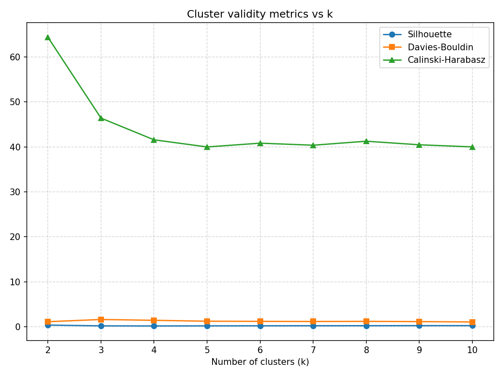

# Q1 Cluster Validity Sweep

Data source: `session_catalog_q1.json` – **120 sessions used** (rows with missing metrics dropped).

## Scores table

| k | Silhouette | Davies‑Bouldin | Calinski‑Harabasz |
|---|---|---|---|

| 2 | 0.3571 | 1.1094 | 64.38 |

| 3 | 0.1847 | 1.6019 | 46.40 |

| 4 | 0.1635 | 1.4186 | 41.57 |

| 5 | 0.1841 | 1.2149 | 39.98 |

| 6 | 0.2007 | 1.1833 | 40.82 |

| 7 | 0.2120 | 1.1544 | 40.37 |

| 8 | 0.2187 | 1.1819 | 41.26 |

| 9 | 0.2301 | 1.1340 | 40.47 |

| 10 | 0.2334 | 1.0475 | 40.00 |

## Score plot

