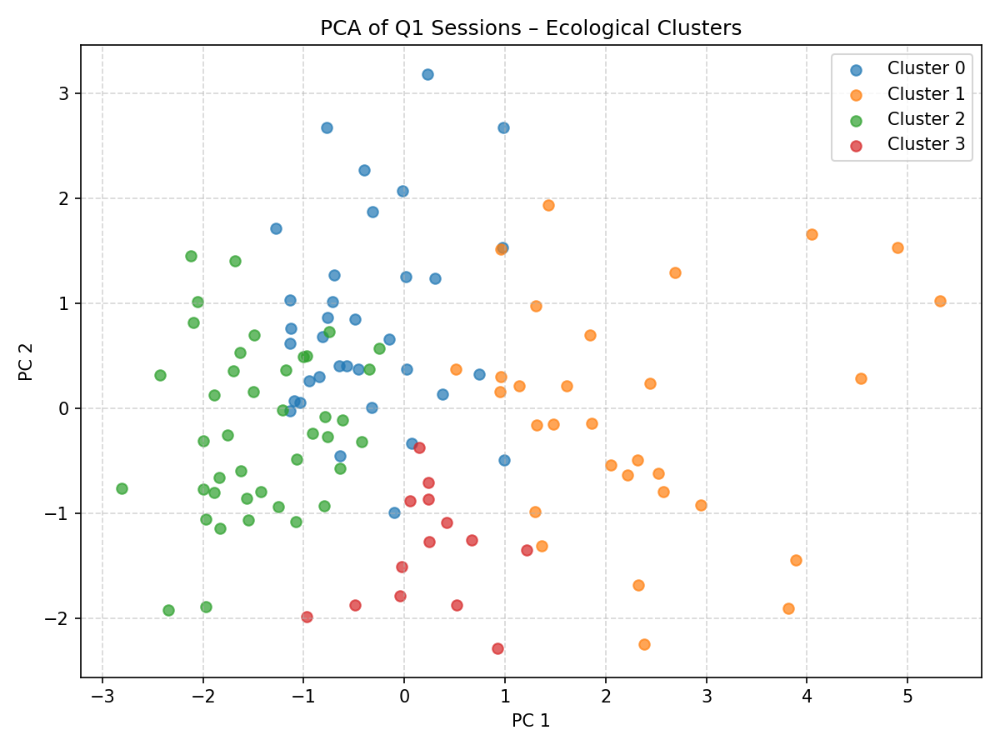

# Q1 Ecological Clustering Report

Generated from `session_catalog_q1.json` – **120 sessions**.

**Number of clusters:** 4

## Cluster Highlights

### Cluster 0

* Sessions: 35

* Representative (highest volatility): 2025-02-12 BANKNIFTY

| Metric | Value |
|---|---|

| realized_volatility | 0.0006 |

| trend_strength | 3.1525 |

| gap_pct | 0.0884 |

| session_range_pct | 1.9594 |

| net_return_pct | 0.2516 |

### Cluster 1

* Sessions: 30

* Representative (highest volatility): 2025-01-21 NIFTY

| Metric | Value |
|---|---|

| realized_volatility | 0.0007 |

| trend_strength | 19.2838 |

| gap_pct | 0.3625 |

| session_range_pct | 1.9190 |

| net_return_pct | 1.5738 |

### Cluster 2

* Sessions: 41

* Representative (highest volatility): 2025-03-11 BANKNIFTY

| Metric | Value |
|---|---|

| realized_volatility | 0.0004 |

| trend_strength | 0.4476 |

| gap_pct | -0.6092 |

| session_range_pct | 0.6813 |

| net_return_pct | 0.0226 |

### Cluster 3

* Sessions: 14

* Representative (highest volatility): 2025-03-19 BANKNIFTY

| Metric | Value |
|---|---|

| realized_volatility | 0.0003 |

| trend_strength | 17.8851 |

| gap_pct | -0.0003 |

| session_range_pct | 0.9777 |

| net_return_pct | 0.7123 |

