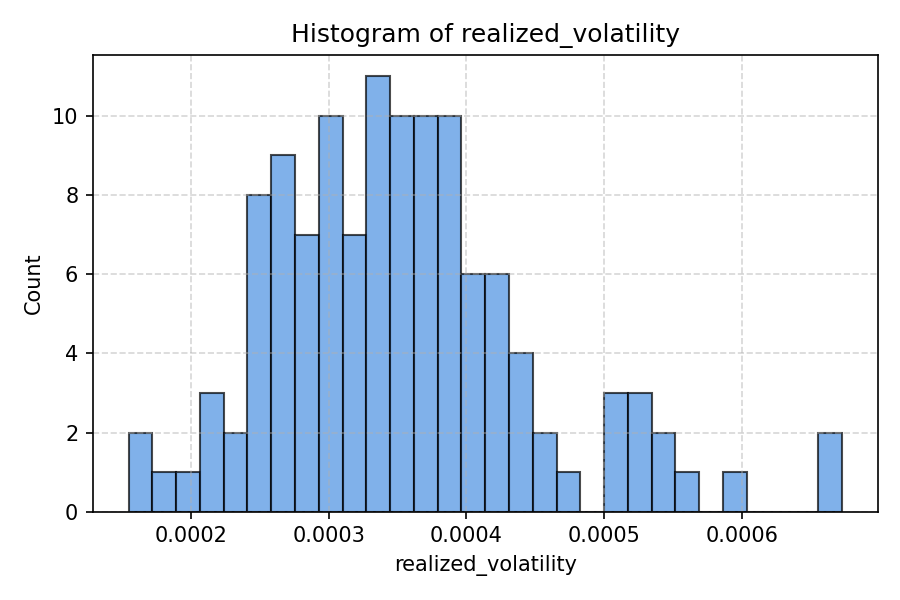
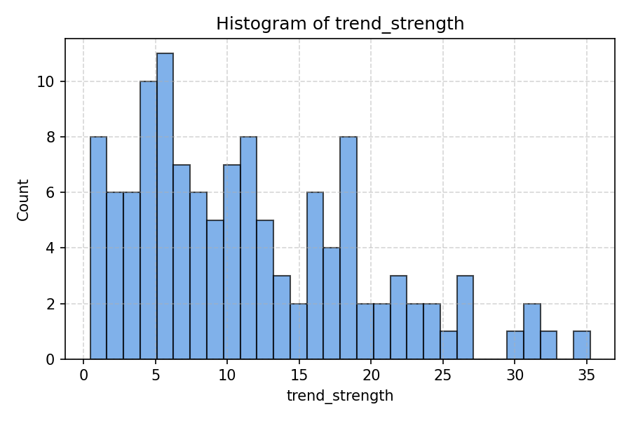
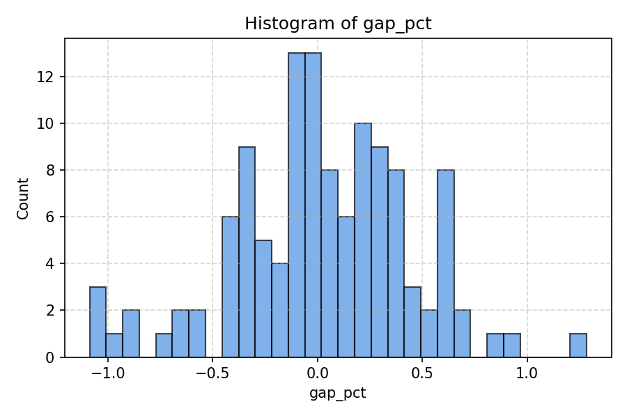
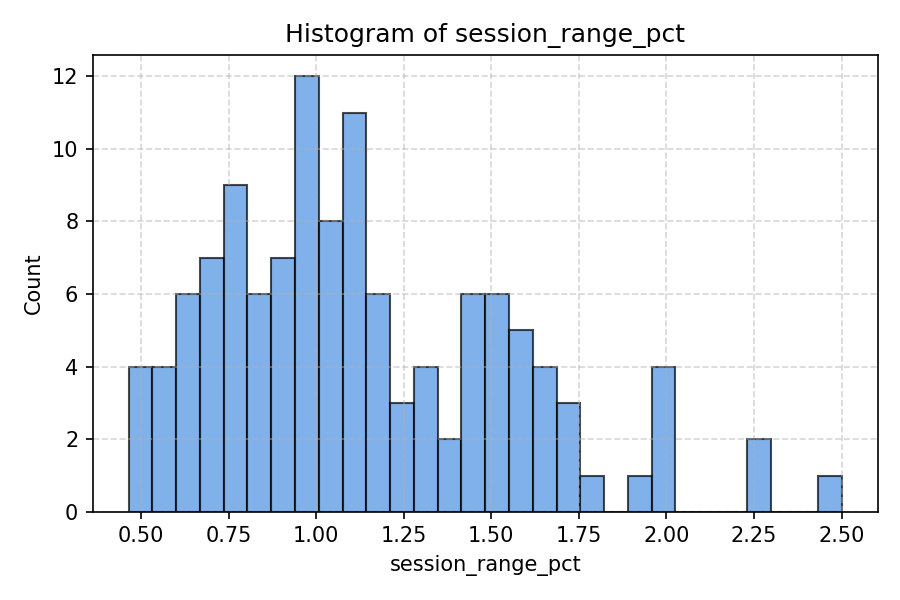
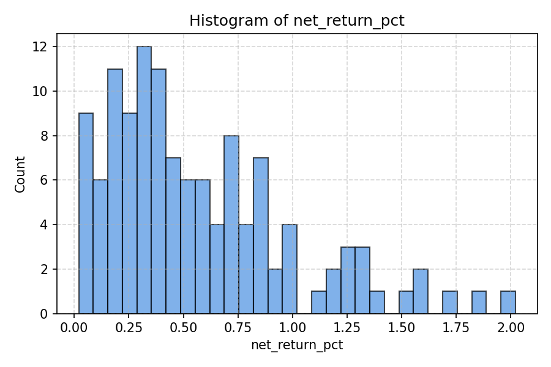

# Q1 Metric Distribution Report

Generated from `session_catalog_q1.json` – **122 sessions**.

## Realized Volatility

| Statistic | Value |
|---|---|

| count | 122.0000 |

| min | 0.0002 |

| max | 0.0007 |

| mean | 0.0004 |

| median | 0.0003 |

| std | 0.0001 |

| skew | 0.7774 |

| p5 | 0.0002 |

| p25 | 0.0003 |

| p75 | 0.0004 |

| p95 | 0.0005 |

| outliers | 14.0000 |

---

## Trend Strength

| Statistic | Value |
|---|---|

| count | 122.0000 |

| min | 0.4476 |

| max | 35.2518 |

| mean | 11.5645 |

| median | 10.3002 |

| std | 8.0237 |

| skew | 0.8027 |

| p5 | 1.3894 |

| p25 | 5.3261 |

| p75 | 17.1738 |

| p95 | 26.1098 |

| outliers | 14.0000 |

---

## Gap Pct

| Statistic | Value |
|---|---|

| count | 120.0000 |

| min | -1.0876 |

| max | 1.2830 |

| mean | 0.0248 |

| median | 0.0147 |

| std | 0.4249 |

| skew | -0.2685 |

| p5 | -0.7670 |

| p25 | -0.2272 |

| p75 | 0.3193 |

| p95 | 0.6422 |

| outliers | 12.0000 |

---

## Session Range Pct

| Statistic | Value |
|---|---|

| count | 122.0000 |

| min | 0.4648 |

| max | 2.5007 |

| mean | 1.1343 |

| median | 1.0668 |

| std | 0.4179 |

| skew | 0.7756 |

| p5 | 0.5809 |

| p25 | 0.8161 |

| p75 | 1.4596 |

| p95 | 1.9574 |

| outliers | 14.0000 |

---

## Net Return Pct

| Statistic | Value |
|---|---|

| count | 122.0000 |

| min | 0.0205 |

| max | 2.0209 |

| mean | 0.5683 |

| median | 0.4687 |

| std | 0.4307 |

| skew | 1.1250 |

| p5 | 0.0637 |

| p25 | 0.2574 |

| p75 | 0.8037 |

| p95 | 1.3628 |

| outliers | 14.0000 |

---
