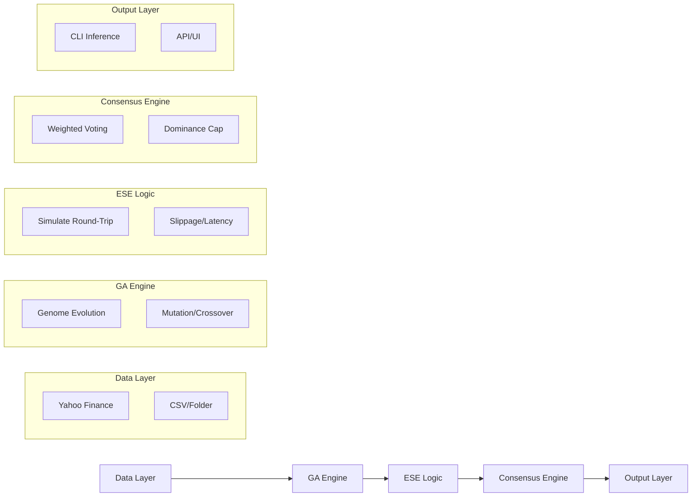

# ChronoSentiment — Master System Documentation
## Full Technical Specification | Theoretical Framework | Operational Guide
**Version**: 10.9 (Institutional Grade)

---

## 📘 1. Executive Overview

**ChronoSentiment** is a high-precision, deterministic trading simulation and strategy discovery engine. Its core objective is to move beyond probabilistic "black-box" models by employing a **Genetic Algorithm (GA)** that evolves selective, high-conviction strategies within a **Execution Simulation Engine (ESE)** that rigorously models market friction.

### The "DHARVI" Philosophy
ChronoSentiment is built on the principle of **Informed Selectivity**. The system does not attempt to predict every tick; instead, it identifies rare windows of high alpha density where the signal-to-noise ratio is historically superior.

### The System Contract
*   **Absolute Determinism**: The same (Data + Genome + Seed) always results in the same signal.
*   **Zero Future Leakage**: Strict cursor-based evaluation ensures the engine never "sees" the future.
*   **Real-Price Integrity**: Internal 1/100th paisa precision eliminates rounding errors in cumulative PnL.

---

## ⚙️ 2. System Architecture

ChronoSentiment is structured as a five-layer pipeline, ensuring a clean decoupling of data, logic, and output.



### Components
1.  **Data Layer**: Abstracts market sources into a unified `CandleSource`.
2.  **GA Engine**: Discovery layer that evolves a population of `Strategy` configurations.
3.  **ESE (Execution Simulation Engine)**: The "Physics Engine" that validates strategies against realistic execution constraints.
4.  **Consensus Engine**: The decision-making layer that aggregates elite strategies into a single actionable signal.
5.  **Output Layer**: Interfaces for humans (CLI) and machines (API).

---

## 🧬 3. Genetic Algorithm (GA Deep Dive)

The GA is the "Intelligence" of the system, responsible for discovering parameters that survive market friction.

### Genome Structure (`Strategy`)
A strategy genome consists of four primary genes:
*   **Queue Threshold**: Market pressure requirement for entry.
*   **Base Edge**: The minimum institutional "tilt" required.
*   **Take Profit (TP)**: Target exit in basis points.
*   **Stop Loss (SL)**: Risk exit in basis points.

### Mutation & Adaptive Stagnation
To prevent local optima, the mutation logic in Phase 6+ employs **Adaptive Scaling**:
> `stagnation_jump = 1.0 + (stagnation_counter)^2 * 0.1`

If a population stops improving (stagnates), the mutation intensity increases exponentially, "jumping" the population to new areas of the parameter space.

### Elitism & Diversity
The system preserves the top-K genomes (Elitism) while penalizing strategies that are too similar in behavior (Diversity), ensuring the pool of candidates remains robust across different market regimes.

---

## 🧠 4. ESE (Execution Simulation Engine)

The ESE is what makes ChronoSentiment "Execution-Aware." It models what happens *after* a signal is generated.

### Deterministic Round-Trip Simulation
The function `ga_simulate_round_trip_at_cursor` is the core of this layer. It simulates a trade from a specific index without ever looking at data indices `j < entry_idx`.

### Friction Modeling
*   **Latency**: Configurable ticks (`latency_ticks`) between signal detection and order entry.
*   **Slippage**: Fractional price impact (`slippage_factor`) based on the bid-ask spread.
*   **Trailing Stop (Phase 10)**: An institutional guard that moves the stop-loss to Breakeven once `PnL >= 15 bps`.
*   **Early Profit Capture**: A "Sniper" exit that triggers if price moves significantly in our favor before the formal TP is hit.

---

## 📡 5. Live Inference Engine

The Live Inference mode transforms the discovery engine into a real-time monitor.

### Async Integration
*   **Async Ingestion**: The system pulls the latest 1m/5m candles from Yahoo/Binance.
*   **Sync Evaluation**: The strategy pool is evaluated against the most recent candle window using the deterministic ESE logic.

---

## 🧠 6. Consensus & Decision Engine (Phase 10.9)

Agreement is the ultimate filter for noise.

### Weighted Voting
Each elite strategy's vote is weighted by its historical `Fitness`.

### 🛡️ 25% Dominance Cap
No single strategy can control more than 25% of the total consensus weight. This prevents "Super-Genome" bias and ensures that signals represent a multi-strategy agreement.

### Conviction Math
> `conviction = |weighted_buy_weight - weighted_sell_weight|`

*   **MVC (Minimum Viable Conviction)**: Set at `0.55`.
*   **No-Trade Zone**: If conviction is below MVC, the system returns `WAIT`.

---

## 📊 7. Data & Scaling Model

To ensure sub-penny precision without floating-point errors, ChronoSentiment uses **Internal Integer Scaling**.

### The Rule of 10,000
*   **`PRICE_SCALE = 10000`**: All prices are stored internally as `u64`.
*   **Example**: ₹432.85 is stored as `4,328,500`.
*   **Unit**: 1 unit = 1/100th of a paisa (0.0001 Rupees).

### Boundary Layer (`PriceDto`)
Scaling exists **only** in the core and database. The API layer uses `PriceDto` to automatically convert internal integers back to real-unit floats for the UI/UX.

---

## 🧪 8. Testing & Determinism

ChronoSentiment achieves 100% reproducibility through:
1.  **Seed-Based RNG**: Using `StdRng` with a fixed seed for GA evolution.
2.  **Stateless Evaluation**: Strategies are evaluated against a static data slice.
3.  **Twin-Run Validation**: A feature that runs the same configuration twice to ensure bit-level identical PnL.

---

## 📈 9. Usage Guide (Operator Manual)

### Running the System
```bash
cargo run --example live_inference -- BTC-USD
```

### Understanding the CLI Output
```text
Time      | Sig   | Consensus  | Strength | Conf   | Edge   | Action    | Reason
-------------------------------------------------------------------------------------
01:42:05  | BUY   | 8/10       | STR ✅   | 0.78   | 42.1bp | [EXEC BUY]| ---
01:43:05  | WAIT  | 4/10       | WK  ❌   | 0.32   | 12.4bp | WAIT      | LOW_CONVICTION
```

### WAIT Taxonomy (Reasons for Inactivity)
*   **LOW_CONVICTION**: Agreement < 0.55.
*   **REJECTED_REGIME**: Volatility too high/dangerous.
*   **LOW_VOTER_COUNT**: Bootstrapping or health-check failure.

---

## 🔄 10. Signal Lifecycle

1.  **Detection**: Market data matches a strategy's entry genes.
2.  **Validation**: ESE confirms trade viability with friction.
3.  **Consensus**: Multi-strategy weighted voting.
4.  **Guardrail**: Dominance cap and MVC check.
5.  **Decision**: `EXECUTE` or `WAIT`.

---

## 📉 11. Known Failure Modes & Limitations

*   **Volatility Lag**: Lag in reclassifying regimes during black-swan events.
*   **Structural Breaks**: Fundamental market shifts requiring GA retraining.
*   **No Execution Layer**: The system generates **Alpha Signals**, not automatic fills.
*   **Liquidity Assumption**: High-volume slippage is modeled but not guaranteed against thin order books.

---

## 📂 12. Developer Guide

### Extending the System
*   **Adding a Data Source**: Implement the `CandleSource` trait in `core/src/data_source/`.
*   **Adding a Gene**: Add the field to `Strategy` in `ga.rs` and update `mutate_strategy` and `crossover`.
*   **Debugging GA**: Set `GA_DEBUG=1` to see generational fitness components in the logs.

---

## 📜 13. Appendix: Constant Thresholds

| Constant | Value | Description |
| :--- | :--- | :--- |
| `PRICE_SCALE` | 10000 | Internal precision multiplier. |
| `GA_GENE_SCALE` | 100 | Gene-specific precision scaling. |
| `MVC` | 0.55 | Minimum conviction to issue a signal. |
| `DOMINANCE_CAP` | 0.25 | Max influence per strategy in consensus. |
| `BSW_TRIGGER` | 15 bps | PnL required to move SL to Breakeven. |
