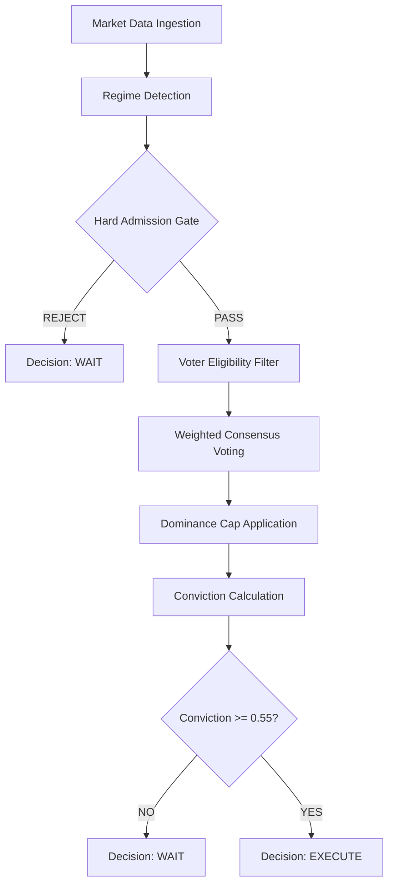

# ChronoSentiment — Institutional Live Inference Engine
### Product Manual & User Guide | Phase 10.9 (Institutional Release)

---

## 1. Product Overview & System Contract

**ChronoSentiment** is a deterministic, multi-strategy consensus engine designed for elite signal discovery in high-frequency trading environments. Unlike probabilistic systems that "guess" market direction, ChronoSentiment uses a genetic evolution framework to identify strategies with proven alpha density and aggregates them into a single, high-conviction decision.

### 🧾 The System Contract
To maintain institutional trust, every inference session adheres to the following guarantees:

*   **Absolute Determinism**: Given the same market data and genome configuration, the system will produce the exact same signal. No stochastic randomness in live inference.
*   **Zero Future Leakage**: The engine is architecturally isolated; it can only "see" data up to the current tick. There is no lookahead bias.
*   **Real-Price Integrity**: All calculations are performed using sub-penny precision and normalized to real market units (e.g., Rupees or USD).
*   **Guardrail-Bounded**: No trade is ever suggested without passing the Multi-Stage Admission Gate (Dominance, Conviction, and Regime checks).

---

## 2. Signal Lifecycle

Every candle update triggers a sequence of analytical stages before a decision is rendered:



1.  **Ingestion**: Real-time candle data (OHLCV) is pulled from market sources.
2.  **Regime Detection**: Current volatility and trend structure are analyzed.
3.  **Admission Gate**: The system refuses to trade in "noisy" or extreme volatility regimes (e.g., `norm_vol > 0.005`).
4.  **Voter Filtering**: Only top-performing strategies (Elite Genomes) with `fitness > 0` and `consistency > 0.6` are allowed to vote.
5.  **Weighted Voting**: Voters cast Buy/Sell/Wait votes weighted by their historical fitness.
6.  **Dominance Control**: No single strategy can hold more than 25% of the total voting power.
7.  **Conviction**: The absolute difference between weighted Buy and Sell pressure is calculated.

---

## 3. Key Concepts (Institutional Grade)

### Confidence vs. Conviction
The engine distinguishes between "What we see" (Edge) and "How much we agree" (Imbalance).

*   **Confidence (Conf)**: The normalized expected edge from the voter ensemble. This represents the *scaled magnitude* of the predicted move.
*   **Conviction (Conv)**: The directional agreement (buy vs. sell imbalance) calculated as:
    > `conviction = |weighted_buy_pressure - weighted_sell_pressure|`

*   **0.55 (Min Threshold)**: The Minimum Viable Conviction (MVC). Anything below this is considered "market noise."
*   **0.75+ (Strong Consensus)**: High agreement with significant cumulative edge.

### Voters & Participation Rate
*   **Voters (X/Y)**: `X` is the number of elite strategies agreeing with the signal. `Y` is the total eligible pool (Max 10).
*   **Participation Rate**: Calculated as `X / Y`. A high participation rate (e.g., 9/10) indicates broad consensus across different strategy archetypes.

### Edge (bp)
The **Edge** represents the expected return in **basis points** (1/100th of 1%) over the expressed horizon. It is a risk-adjusted mean of the voter ensemble's predicted outcomes.

### Horizon Awareness & Signal Expiry
Each signal is issued with an implicit **Expressed Horizon (N Bars)**. 

**A signal is considered EXPIRED and invalid if:**
1.  **Horizon Exceeded**: The `N` bar window has passed without the edge manifesting.
2.  **Opposite Signal**: The consensus shifts to the opposing direction (e.g., BUY -> SELL).
3.  **Conviction Collapse**: Conviction drops below the 0.55 MVC threshold.
4.  **Regime Shift**: The Hard Admission Gate triggers a `REJECTED_REGIME` status.

---

## 4. How to Run

Execute the live inference engine via the CLI:

```bash
# General usage
cargo run --example live_inference -- [SYMBOL]

# Example: Monitoring Bitcoin in 1m intervals
cargo run --example live_inference -- BTC-USD
```

---

## 5. The Inference Interface & WAIT Taxonomy

### 🖥️ CLI Dashboard (Live Monitoring)
```text
🚀 CHRONOSENTIMENT INSTITUTIONAL LIVE INFERENCE
========================================================================================================================
📡 Monitoring: BTC-USD | Interval: 1m | Mode: Multi-Strategy Consensus
------------------------------------------------------------------------------------------------------------------------
Time      | OHLC [O|H|L|C]            | Sig   | Consensus  | Strength | Conf   | Edge   | Action    | Reason
------------------------------------------------------------------------------------------------------------------------
01:42:05  | 64100|64150|64080|64120   | BUY   | 8/10       | STR ✅   | 0.78   | 42.1bp | [EXEC BUY]| ---
01:43:05  | 64120|64130|64110|64125   | WAIT  | 4/10       | WK  ❌   | 0.32   | 12.4bp | WAIT      | LOW_CONVICTION
01:44:05  | 64125|64140|64120|64135   | BUY   | 6/10       | MED ✅   | 0.62   | 28.5bp | [EXEC BUY]| ---
------------------------------------------------------------------------------------------------------------------------
```

### 🧠 Structured WAIT Taxonomy (Debugging Interface)
When the status is `WAIT`, the reason is mapped to the following causes:

| Code | Reason | Description |
| :--- | :--- | :--- |
| **LOW_CONVICTION** | `< 0.55` | Agreement exists but not enough to offset market risk. |
| **REJECTED_REGIME** | `norm_vol > 0.005` | Volatility spike detected; alpha capture is unreliable. |
| **LOW_VOTER_COUNT** | `< 3` | Not enough elite strategies passed the health check. |
| **INSUFFICIENT_DATA** | `candles < 100` | Cold-start state; waiting for market history. |

---

## 6. Intelligence Logic: Dominance & No-Trade Zone

### 🛡️ 25% Dominance Cap
Even if Strategy A has 10x the fitness of Strategy B, its influence is truncated to prevent "black-swan bias" from a single genome.

```text
[BUY]  ████████████████████ 40%
[SELL] ████████████ 25%
[HOLD] ███████████████ 35%

STATUS: DOMINANCE_CONTROL ACTIVE ✅ (Capped at 25% per Voter)
```

### 🚷 No-Trade Zone
The system will **never** issue an `EXECUTE` signal if `conviction < 0.55`. This is the hard floor for institutional participation.

---

## 7. How to Read Like a Trader

Interpret signals based on their "Profile":

*   ** Sniper (High Conviction + Low Voters)**: Specialized strategies seeing a niche, high-quality setup.
*   ** Consensus (Med Conviction + High Voters)**: Broad market trend confirmed by the entire fleet.
*   ** Noise (Low Conviction + Low Voters)**: Market is scanning; steer clear.

---

## 8. Visual Decision Flow

```text
[DATA VALID] ✅ --> [REGIME STABLE] ✅ --> [VOTERS ≥ 3] ✅ --> [DOMINANCE OK] ✅ 

--> [CONVICTION ≥ 0.55?] ✅ 

RESULT: EXECUTE
```

---

## 9. System Boundaries & Institutional Guardrails

### 🛑 What This System Is NOT
*   **NOT an Execution Layer**: Decisions are suggested but not executed automatically.
*   **NOT a Profit Guarantee**: Past performance of genomes is an indicator, not a certainty.
*   **NOT a News Sensor**: The engine ignores sentiment/news; it is purely price-action deterministic.

### ⚠️ Known Failure Modes
Institutional transparency requires acknowledging where the system is most vulnerable:

*   **Volatility Lag**: Sudden, "fat-tail" volatility spikes may cause a 1-2 bar lag in regime reclassification.
*   **Structural Breaks**: Fundamental shifts (e.g., protocol hacks, major regulatory shifts) can render historical genome patterns obsolete.
*   **Liquidity Thinning**: In low-liquidity environments, the system's "perfect fill" simulation will deviate significantly from real-market slippage.

---
